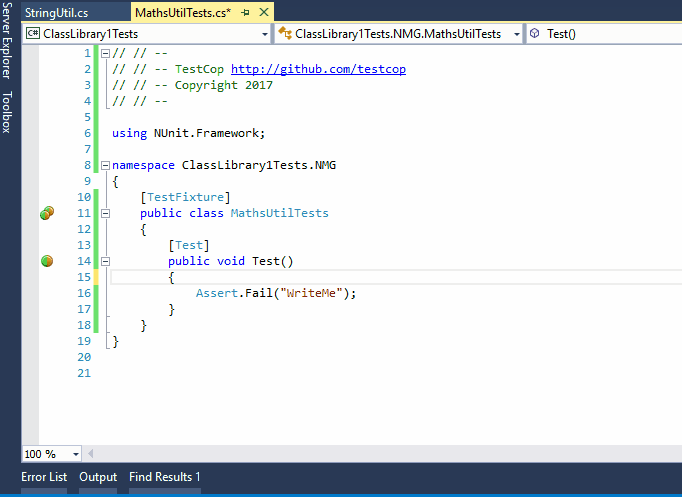

*Testcop - a Resharper plugin to help with unit tests**

Effortlessly switch between code and unit test...

* Documentation:
  * [TestCop For Resharper Wiki](wiki/README.md)
  
* The actively maintained download location is here:
	* [https://resharper-plugins.jetbrains.com/packages/](https://resharper-plugins.jetbrains.com/packages/Resharper.TestCop.R9/)

* Bug Reporting
	* [https://github.com/testcop/Resharper.TestCop](https://github.com/testcop/Resharper.TestCop/issues)
	Ideally with a merge request

* This shows the plugin in action:
	* 
	
