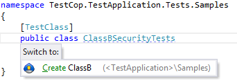
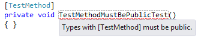
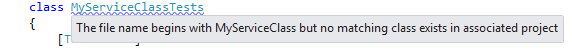
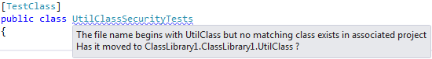
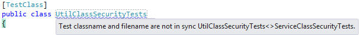
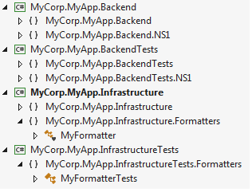
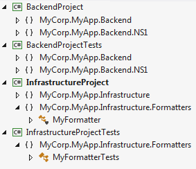
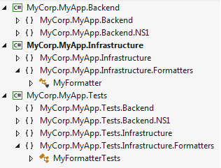

*Testcop - a Resharper plugin to help with unit tests**

Effortlessly switch between code and unit test...

### First things first
* The actively maintained download location is here:
	* [https://resharper-plugins.jetbrains.com/packages/Resharper.TestCop.R9/](https://resharper-plugins.jetbrains.com/packages/Resharper.TestCop.R9/)

## Overview
TestCop is a [resharper plugin](http://www.jetbrains.com/resharper/plugins/index.jsp) that helps when working with unit tests. This plugin is designed for use with mstest & [nunit](http://www.nunit.org/) but should work with any other unittest framework that requires you to assign a test attribute (e.g. [TestFixture](https://github.com/nunit/docs/wiki/TestFixture-Attribute)) to your unit test classes and/or methods. It has a number of resharper inspections that help ensure healthy test projects that follow an approach I've been using for a number of years where each code assembly has an associated test assembly.

Testing and how to write tests are a very personal thing...this is something I've developed in my spare time and found useful enough to share with the wider community...it won't suit every project/solution/individual.

## Run associated tests
Launch the test runner to run tests within the associated test files of the class file you are viewing (ctrl-g,ctrl-x).

## Toggle between code and test
The plugin provides a [keyboard shortcut](keyboard_shortcut.md) (ctrl-g,ctrl-t) to switch between code and test files (the reason why I originally wrote the plugin). It uses the name of the test file to identify the name of the class under test and when toggling between code and test it can optionally look for usages within the test assembly. If the class file/test is missing it will offer to create it in the correct location. In the screen shot below the file named ClassB.SecurityTests.cs contains the class ClassBSecurityTests.

And a number of Resharper highlightings to help with writing and maintaining tests within larger solutions.
## Highlightings

* Methods using the test attribute must be public

* The class name within the test file name doesn't exist in a nontest project

* The class name within the test file name exists but is in a different assembly to the one expected

* The class name within the test file name doesn't match the test class

## Find code that is not part of the project
Usually any code that isn't compiled as part of the project whether an orphaned file or commented code should be deleted. Testcop looks for *.cs files within project folders that aren't part of the project. Highlightings are created against AssemblyInfo.cs. 

## Rename associated test files when you rename class files
If you keep your tests in the correct folders and named the way TestCop likes them to be (e.g. ClassATests or ClassA.SomethingTests) then Testcop will rename those files when you do a rename refactor on the class (ClassA).

# Configuration
If your test projects conform to one of the three usage standards listed below then TestCop is for you and if you need help finding the option dialog for plugins then refer to : [testcop options page](testcop_options_page.md) 

## Usage 1 : Multiple test projects identified by namespace 
This is the default approach. Where each test project maps to one code project via the namespace. Detail : [Each test project maps to a code project via namespace](Each_test_project_maps_to_a_code_project_via_namespace.md)

## Usage 2 : Multiple test projects identified by project name
Where each test project maps to one code project via the project name. In this configuration the namespace of the test project and associated code project are the same. Detail : [Each test project maps to a code project via project name](Each_test_project_maps_to_a_code_project_via_project_name.md)

## Usage 3 : Single test project in a solution
A single test project for all code projects within an assembly is supported but configuration is a little more complex. Detail : [Single Test Project Within Solution](Single_Test_Project_Within_Solution.md)

## Keyboard Shortcuts
Note: TestCop will register [keyboard shortcut](keyboard_shortcut.md) Ctrl-G,Ctrl-T (go test) and Ctrl-G,Ctrl-X (run tests) - you may need to re-assign any conflicting shortcuts.

## TestCop Installation 
Installation is via the Resharper -> Extensions Manager menu item. Very easy to use. 
[https://resharper-plugins.jetbrains.com/packages?q=testcop](https://resharper-plugins.jetbrains.com/packages?q=testcop)
