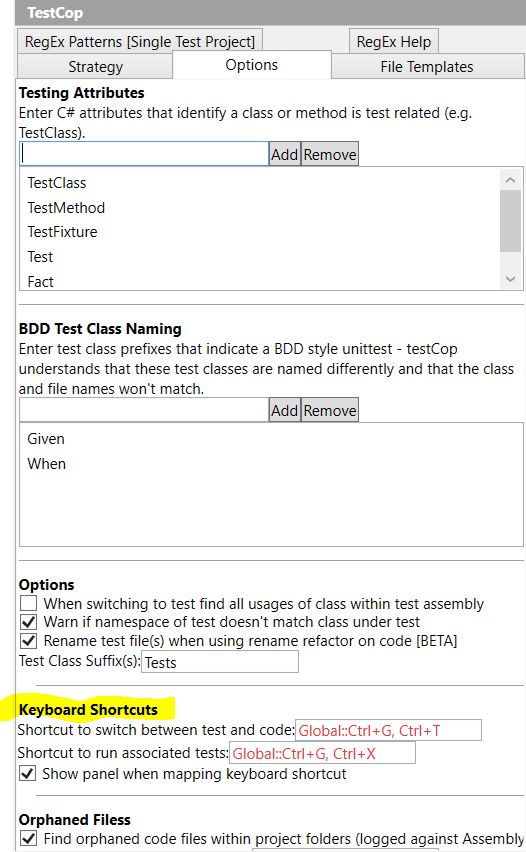

On start up the plugin will register ctrl-g,ctrl-t against the code->test->code macro

To change the keyboard mapping, change the setting within the TestCop options page found within ReSharper->Options->Testcop 

