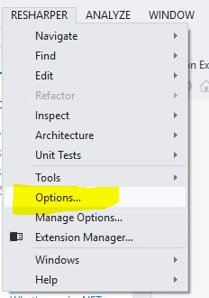
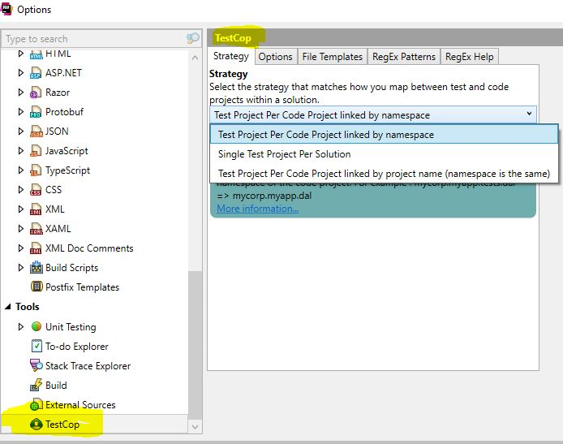
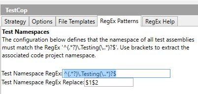

You find the Testcop options page via the resharper plugin options...

## Select 'options' from within the Visual Studio Resharper menu

## Select Testcop within the left pane and choose the test usage strategy

## Configure your regex
